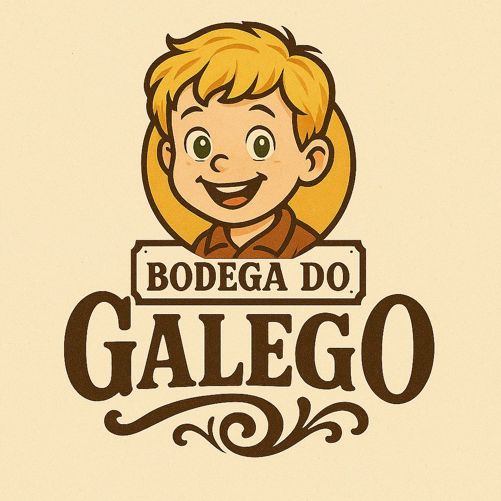

# 🛒 Bodega do Galego — Vitrine Virtual & Painel Administrativo

<p align="center">
  
</p>

<p align="center">
  <strong>Uma solução web de alta performance para exibição e gestão de acessórios tecnológicos.</strong><br>
  ⚡ Interface Fluida • 🌓 Modo Escuro Nativo • 🛡️ Painel Administrativo Seguro
</p>

---

## 📝 Sobre o Projeto

A **Bodega do Galego** é uma plataforma web desenvolvida para modernizar a exposição de produtos e acessórios tecnológicos. O ecossistema divide-se em duas grandes frentes: uma **Vitrine Virtual** pública integrada com links de pedidos para o WhatsApp e um **Dashboard Administrativo** privado para a gestão rápida do catálogo (Adicionar, Editar e Remover produtos) em tempo real.

O projeto foi construído focando-se em **UI/UX consistente**, performance de carregamento e fidelidade à identidade visual da marca (tons de dourado, marrom e creme).

---

## ✨ Funcionalidades Principais

### 🛍️ Vitrine Virtual (Cliente)
* **Carrossel Dinâmico:** Destaque dos principais produtos com transições suaves.
* **Filtro por Categorias:** Navegação segmentada (Cabos, Fones, Áudio, Reparos, Acessórios).
* **Barra de Pesquisa Inteligente:** Filtro de produtos em tempo real por nome com feedback visual e ícones dinâmicos.
* **Redirecionamento para WhatsApp:** Clique no produto gera automaticamente uma intenção de compra direta para o vendedor.

### 🔐 Painel Administrativo (Gestão)
* **Autenticação Segura:** Tela de login protegida com recurso de ocultar/mostrar senha através de interação visual.
* **CRUD de Produtos:** Controle total sobre os itens exibidos (Nome, Preço, Categoria, Link de Imagem e Status de Estoque).
* **Preview de Imagem:** Validação visual e tratamento de URLs inválidas antes de salvar o produto.
* **Mensagens de Feedback (Toasts):** Alertas animados para operações bem-sucedidas ou falhas no sistema.

### 🌓 Recursos Globais
* **Gerenciador de Temas:** Alternância entre *Modo Claro* e *Modo Escuro* com persistência de dados local (`localStorage`) para evitar flashes de luz indesejados ao recarregar a página.

---

## 🛠️ Tecnologias Utilizadas

O projeto foi edificado utilizando tecnologias web nativas para garantir o máximo de velocidade, indexação e leveza:

* **HTML5:** Estruturação semântica e acessível de todos os blocos de conteúdo.
* **CSS3:** Estilização baseada em *Design Tokens* (variáveis), CSS Grid, Flexbox e animações fluidas (`shake`, `float`, `slideUp`).
* **JavaScript (ES6+):** Manipulação dinâmica do DOM, lógica de estados locais e persistência de dados.
* **Font Awesome (v6.7.2):** Kit de ícones vetoriais de alta fidelidade para enriquecimento da interface gráfica.

---

## 📁 Estrutura de Pastas

```text
├── css/
│   ├── admin.css          # Estilização exclusiva do Dashboard Admin
│   ├── global.css         # Variáveis (tokens), resets, temas e animações gerais
│   ├── login.css          # Design do formulário de acesso
│   └── vitrine.css        # Layout da loja pública e carrossel
├── js/
│   ├── admin.js           # Lógica do CRUD, tabelas e manipulação de formulários
│   ├── dados.js           # Base de dados local / Mock dos produtos cadastrados
│   ├── login.js           # Controle de acessos e alternância de visualização da senha
│   ├── tema.js            # Engine de controle Dark Mode / Light Mode
│   └── vitrine.js         # Renderização dinâmica dos produtos e filtros da vitrine
├── img/
│   └── logo.jpeg          # Logomarca oficial do estabelecimento
├── admin.html             # Estrutura do Painel de Controle
├── index.html             # Página principal (Vitrine Virtual)
└── login.html             # Portal de Acesso Administrativo
